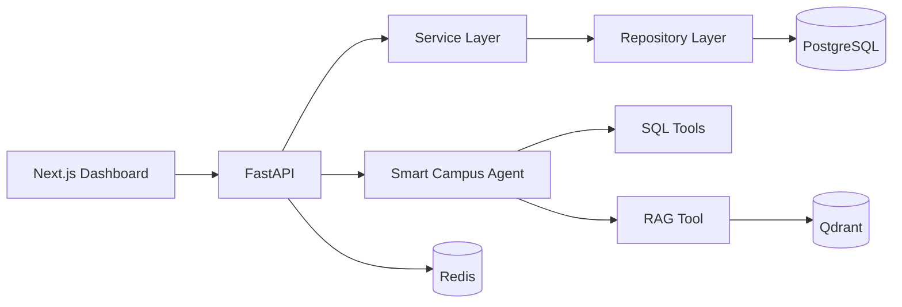

# SmartCampus AI Copilot

智慧校园运维与供应链 AI Agent 平台

## Background

校园后勤同时管理设备运维和供应链。信息分散在实时业务库、设备手册、SOP、合同和制度中，传统检索难以完成跨数据源诊断。本项目用一个可调用工具的 AI Copilot 统一这些工作流。

## Business Problems

- 查询设备、巡检、故障和维修工单，结合手册与 SOP 诊断故障。
- 分析采购价格、配送延误和库存，并结合供应商合同判断处罚条件。
- 严格区分 PostgreSQL 业务事实、Qdrant 非结构化知识和后续 Business API 写操作。

## Architecture



V0.2 adds a working Basic RAG path for equipment maintenance knowledge, including upload, parsing, dense retrieval, grounded generation, citations, and retrieval observability.

## Tech Stack

- Frontend: Next.js 14, React, TypeScript strict, Tailwind CSS
- Backend: Python 3.12, FastAPI, Pydantic, SQLAlchemy 2 async
- AI boundaries: LangChain-compatible agent, provider-neutral LLM and embedding protocols
- Data: PostgreSQL 16, Qdrant, Redis 7
- Infrastructure: Docker Compose, uv/pnpm-compatible project metadata

## Project Structure

```text
frontend/                 Next.js dashboard and API client
backend/app/api/          HTTP routes
backend/app/services/     business orchestration
backend/app/repositories/ persistence access
backend/app/models/       SQLAlchemy entities
backend/app/rag/          load/split/embed/store/retrieve boundaries
backend/app/agents/       agent composition boundary
backend/app/tools/        tool contracts and catalog
backend/app/db/           session and idempotent seed
backend/tests/            backend unit tests
data/documents/           future knowledge input
data/seed/                seed documentation
docs/                     architecture notes
```

## Quick Start

Prerequisites: Docker with Compose. Native development requires Python 3.12+, uv, Node 20+, and pnpm 9.

```bash
cp .env.example .env
# replace POSTGRES_PASSWORD and keep DATABASE_URL consistent
docker compose up --build
```

Open the dashboard at `http://localhost:3000`, API docs at `http://localhost:8000/docs`, and health endpoint at `http://localhost:8000/api/health`. The backend container creates tables and applies the idempotent seed before startup.

Native commands:

```bash
cd backend && uv sync --extra dev && uv run python -m app.db.seed && uv run uvicorn app.main:app --reload
cd frontend && pnpm install && pnpm dev
```

## Environment Variables

| Variable | Purpose |
| --- | --- |
| `DATABASE_URL` | SQLAlchemy async PostgreSQL URL |
| `POSTGRES_DB/USER/PASSWORD` | PostgreSQL container credentials |
| `QDRANT_URL` | Qdrant HTTP endpoint |
| `REDIS_URL` | Redis connection URL |
| `BACKEND_CORS_ORIGINS` | Comma-separated allowed browser origins |
| `NEXT_PUBLIC_API_URL` | Browser/server-visible backend URL |
| `LLM_PROVIDER/API_KEY/BASE_URL/MODEL` | Independent generative LLM provider configuration |
| `EMBEDDING_PROVIDER/API_KEY/BASE_URL/MODEL` | Independent embedding provider configuration |

Never commit `.env`.

## API

| Method | Path | Description |
| --- | --- | --- |
| GET | `/api/health` | PostgreSQL, Qdrant, and Redis readiness |
| GET | `/api/devices?limit=100&offset=0` | Paginated device list |
| GET | `/api/devices/{device_id}` | Device detail or unified 404 |
| GET | `/api/dashboard/stats` | Dashboard aggregate counts |
| POST | `/api/knowledge/documents` | Upload and index `.md`, `.txt`, or text PDF |
| POST | `/api/rag/retrieve` | Inspect top-k dense retrieval chunks |
| POST | `/api/rag/ask` | Generate a grounded answer with structured citations |

## Data Model

Core tables are `devices`, `inspection_records`, `maintenance_orders`, `suppliers`, `products`, `purchase_orders`, `delivery_records`, and `contracts`. Foreign keys model device history and the supplier/product purchasing chain. Operational filters have explicit status, time, code, location, and composite indexes.

## Basic RAG

`Document → Parse → Chunk → Embedding → Qdrant → Retrieve → LLM → Citation`

V0.2 accepts Markdown, TXT, and text-based PDF documents. It preserves page and source metadata through configurable recursive chunking, calls an OpenAI-compatible embedding endpoint, and writes deterministic IDs to `smart_campus_knowledge`. Re-importing an unchanged file overwrites the same points instead of growing the collection. `/rag-debug` exposes scores, chunks, and metadata.

Seed the included maintenance documents after configuring the embedding provider:

```bash
cd backend
uv run python -m app.rag.seed_knowledge
```

## Why RAG

Equipment manuals, SOPs, and maintenance guides are private enterprise knowledge that changes independently of an LLM's training data. RAG retrieves the relevant current material at inference time, constrains generation to that context, and returns the actual retriever metadata as citations.

## Model Provider Architecture

Generation and embedding are independently configured and created through separate provider factories:

- DeepSeek currently performs `question + retrieved context → natural-language answer`.
- Qwen/Bailian currently performs `text → vector` for both ingestion and retrieval.
- Qdrant stores vectors and performs cosine similarity search; it is not a model provider.

The RAG chain depends only on `LLMService`, while ingestion and retrieval depend only on `EmbeddingService`. Changing either provider does not require changing RAG business logic. Configure `LLM_PROVIDER`, `LLM_API_KEY`, `LLM_BASE_URL`, and `LLM_MODEL` separately from the corresponding `EMBEDDING_*` variables.

Provider architecture must support both cloud API providers and future local/private deployment providers. DeepSeek and Qwen are current deployment choices, not permanent hard dependencies. The factories already accept `local` and `private` OpenAI-compatible endpoints without requiring an API key, while provider-specific adapters can be added behind the same protocols when a private runtime uses a different transport.

Qdrant collections are created using the first actual embedding vector's dimension. A dimension mismatch produces an explicit error; production code never deletes or recreates an existing collection. In development, use a new collection name and re-run `seed_knowledge`, or explicitly remove the old collection only after confirming its data can be rebuilt.

## Structured vs Unstructured Data

PostgreSQL remains the source of truth for devices, inspections, maintenance orders, suppliers, purchases, and deliveries. Qdrant stores only chunks derived from manuals, SOPs, maintenance guides, contracts, and policies. Structured operational facts are never copied wholesale into the vector database.

## Agent Architecture

`User → LangChain-compatible Agent → Tool Selection → RAG Tool / SQL Tools / Business API Tools`

The tool catalog already reserves knowledge, device, inspection, maintenance, supplier, purchase, and delivery queries. Multi-tool reasoning is deliberately deferred.

## Validation

```bash
cd backend && uv run ruff check . && uv run mypy app && uv run pytest
cd frontend && pnpm lint && pnpm typecheck && pnpm build
docker compose config
```

## Roadmap

- **V0.1 — Infrastructure + Business Data**
- **V0.2 — Basic RAG:** upload, parsing, chunking, embedding, Qdrant, retrieval, LLM, citations — implemented
- **V0.3 — Production RAG:** hybrid search, reranking, metadata filtering
- **V0.4 — Agentic RAG:** RAG Tool + SQL Tools + Business Tools
- **V0.5 — Evaluation + Observability**
- **V1.0 — Production Deployment**
